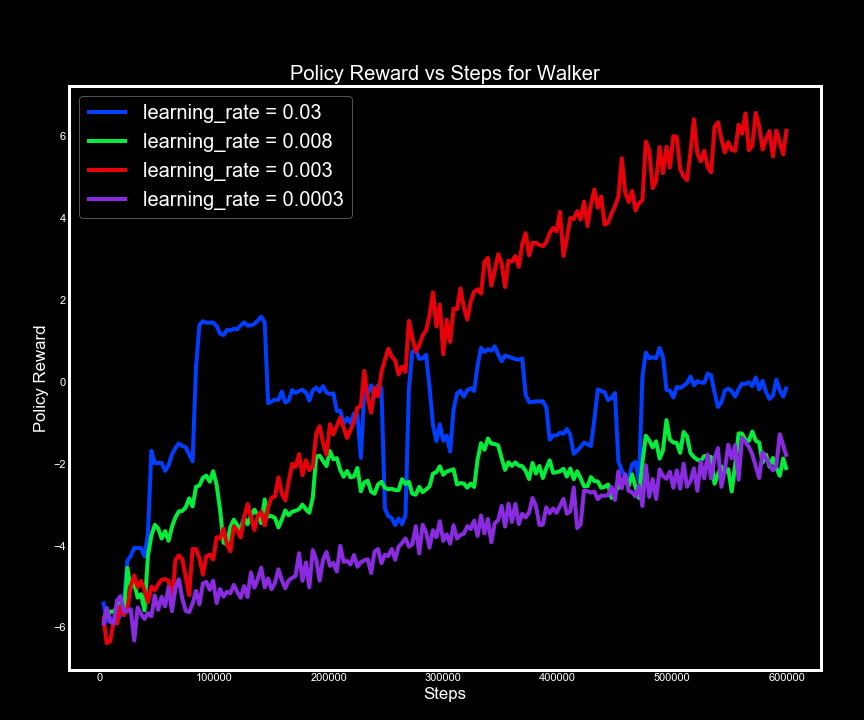

<!-- PROJECT SHIELDS -->
<!-- [![LinkedIn][linkedin-shield]][linkedin-url] -->

  

<!-- PROJECT LOGO -->
 
<!-- 

  

  <h3 align="center">Reinforcement Learning in 3D Simulated Environments</h3> -->

<!--   

    Using Unity to simulate environments to train agents using reinforcement learning.
     
    <a href="https://github.com/rasbot/Reinforcement_Learning_in_Unity"><strong>Explore the docs »</strong></a>
     
     
    <a href="https://github.com/rasbot/Reinforcement_Learning_in_Unity">View Demo</a>
    ·
    <a href="https://github.com/rasbot/Reinforcement_Learning_in_Unity/issues">Reinforcement_Learning_in_Unityrt Bug</a>
    ·
    <a href="https://github.com/rasbot/Reinforcement_Learning_in_Unity/issues">Request Feature</a>
  

 -->

<!-- TABLE OF CONTENTS -->
## Table of Contents

* [Introduction](#introduction)
* [Project Scope](#scope)
* [Reinforcement Learning Algorithms](#algorithms)
  * [PPO](#ppo)
  * [SAC](#sac)
* [Walking Trainer](#walking)
  * [Untrained Walker](#untrained)
  * [PPO Training](#ppotraining)
  * [SAC Training](#sactraining)
  * [Extensions](#extensions)
* [Puncher Trainer](#punching)
  * [Rewards](#rewards)
  * [Scaled Down Version](#scaled)
  * [Testing](#testing)
  * [Rebuilding Game Environment](#smashit)
* [Next Steps](#nextsteps)
* [Contact](#contact)
* [Acknowledgements](#acknowledgements)

<!-- INTRODUCTION -->
## Introduction
---
Reinforcement learning has many useful applications such as robotics and self-driving cars. Researchers in artificial intelligence (AI) are constantly improving learning algorithms, and benefit from the ability to train and test their models in different environments. By enabling testing and training within a simulated environment, algorithms can be improved more rapidly. These ideal environments have a physics engine as well as graphics rendering. This is a benefit as well for companies that need to test and deploy trained models in areas like robotics. Having a fully simulated robot within a simulated environment allows for rapid and cost-effective testing before testing in a real environment with a real robot.

Machine learning (ML) models depend on what type of learning or predictions are involved.

    

If the model will make a prediction of a specific target or label from a set of features, supervised learning can be used. If the data is unstructured or unlabeled, and the target feature is not known, unsupervised learning can be used to find relations between features. If the goal is to have a model learn from the environment through interaction, reinforcement learning is used.

Reinforcement learning involves an __agent__, which could be a robot, a self-driving car, or a video game character, that interacts and learns from the __environment__. The agent observes the environment, takes __actions__, and receives __rewards__ based on those actions. The reward could be positive or negative, such as if a robot moves closer to its target it would get a positive reward, and if it moves away from its target it would get a negative reward. The goal of the model is to maximize the reward to perform a specific task. An agent might not ever receive a positive reward but get penalized such as an agent navigating a maze. The penalty might be a negative reward for each step and the model trains the agent to minimize the penalty. The algorithm used to train the model is called the __policy__. This will be discussed more later.

    

The Unity game engine provides an editor which allows for ML algorithms to interact and learn from a variety of simulated environments. Recently the Unity team released version 1.0 of their [ML Agents toolkit](https://github.com/Unity-Technologies/ml-agents). This toolkit, along with the Unity editor, provides a user with the ability to create 3D simulated environments, a Python API to control and integrate ML algorithms into the environments, and a learning pipeline using C# to collect data from the environment, implement agent actions, and collect rewards. Agents can be trained and tested in the Unity engine using the ML agents toolkit.

    

The Unity Learning Environment

The Python API interfaces with the Unity game engine to create and control ML algorithms in the simulated environment. Python code initializes the environment variables, and feeds agent interactions to the model during training. The trained model is then fed back into the agent during testing.

Environments and game objects are created in Unity giving full control over the physics of the environment.

    

<!-- scope -->
## Project Scope
---
In 2018 I published a mobile game to the Google Play store called `9 to 5 Smash It`. The game was built in the Unity game engine and coded in C#. The game mechanics use a `magic window` which uses a modified GoogleVR APK to track the phones rotation. This gives 3 degrees of freedom which the player can use to move their phone around to see the game world in 360 degrees. The player can do a punch attack by pushing their phone forward, using the phones accelerometer to scale the attack. The harder the player punches the phone forward, the larger the magnitude of the attack in the game. 9 to 5 Smash It is set in an office environment, where the player needs to smash their way through the competition to climb the corporate ladder. Enemies are office-bots which the player needs to punch until they are destroyed. 

The end goal of this project is to train the office-bots to walk and seek out the player, and to train the player to seek out bots and destroy them using reinforcement learning. Using Unity will allow the ability to feed in the specific inputs to the neural net used in deep reinforcement learning. The game objects will be trained within the engine, and the trained models will be deployed in the engine to control the characters. Two algorithms were used to train the walkers, which will be discussed below. 

## Reinforcement Learning Algorithms
---
As mentioned above, the policy is the algorithm used in reinforcement learning (RL). The simplest example, which doesn't involve any learning, is a stochastic policy where an agent randomly moves around an environment. If the goal is to do something like collect all the coins in an environment, a random walk will eventually get the job done. If the policy has feedback from the environment, a more intelligent policy can be adopted.

Reinforcement learning has been used to play simple video games, and improvements to RL algorithms has given researchers and developers a richer ability to train agents to navigate game environments. 

### Proximal Policy Optimization
Proximal policy optimization (PPO) was released in July 2017 by OpenAI. PPO is a deep learning algorithm that balances easy implementation and tuning while minimizing the cost function and evolving the policy in a "safe" manor, by only making small changes to the previous policy. The agent takes actions within the environment and collects rewards associated with those actions. This is done in batches, and after each batch, the gradient of the reward is calculated, and the policy is updated. The batch is thrown out since the policy is updated, and the process is repeated. By not having to store all the batch training information, PPO is more efficient than previous deep reinforcement learning algorithms. 

### Soft Actor Critic
Soft Actor Critic (SAC) seeks to maximize the entropy of the policy. Instead of just playing it safe like PPO, SAC takes greater variation on actions to attempt to maximize the reward. By being more erratic, newer ways to maximize the reward can be found by taking a larger risk. SAC takes longer to train compared to PPO for the same number of epochs, and both policies will be compared.

## Walking Trainer
---
Currently in 9 to 5 Smash It, the bots were 3D modeled to not have legs and instead have wheels or are able to hover. When developing the game, the navigation script to control the bots was all hard-coded behavior. The script allowed the bots to turn toward the player and navigate to them. Obstacle detection was also implemented so the bots could move around things in a believable way. The movements of the bots were animated in the game editor and the script controlled the animations. 

In order to have the robots walk, previous 3D models of the bots would have to be used and they would have to be rigged and animated to walk. For this part of the project, reinforcement learning will be used to train an agent to walk. The Unity ML Toolkit has a walking simulator which was used as a base to train the behavior of walking. The walkers were given rewards for moving forward, and penalties for falling over. After training the walkers, they should be able to walk forward without falling over. After training the models would be integrated into the bot models with legs.

<!-- UNTRAINED WALKER -->
### Untrained Walker
When a walker is untrained, it will just fall over. It has no ability to control the limbs of the walker body. It is not even being told to try to move around since it is not being trained yet.

  

Let's look at how the training process goes for both PPO and SAC.

<!-- PPO WALKER -->
### PPO Training
Training the walkers was done with several agents being trained in parallel. During training, the agents are trying to see how to move in order to maximize their reward for each training batch. For these plots, the `Step Number` is the number of training steps the policy has gone through, and the `Policy Reward` is the total reward for the model as it trains.

    

In order to attempt to increase the performance of the model, some of the hyperparameters were tuned. The optimal value of each is related to the value which produces the largest policy reward over the training time.

#### Hidden Layers
When looking at the hidden layers within the neural net, equal training batches with different numbers of hidden layers were compared.

    

For these runs, training times were around 1 hour. It appears that using one hidden layer is optimal for this amount of training since the policy reward was higher for the entire training session.

#### Learning Rate
The learning rate of the model was also examined. 

    

If the learning rate is too small, the policy will be updated very slowly. If the learning rate is too high, the model will be overfit and will have trouble converging on the maximal policy reward.

This is evident in the higher values of the learning rate. Both the `0.03` and `0.008` trainings show erratic policy rewards as the policy is updated. A learning rate of `0.003` seemed to be optimal here.

#### Summary Frequency
The summary frequency was compared for different training runs as well. This is essentially how often the policy is updated. If the summary frequency is low, the policy will update more often, and the policy reward value will fluctuate compared to a lower summary frequency where the update occurs with larger batches and is generally smoother.

    

#### Number of Parallel Agents Training
This one is not exactly a hyperparameter, but since the agents can be trained in parallel, the number of agents training was compared. The intuition here is that the more agents that are trained in parallel, the better trained the model will be after some amount of training time. If too many agents are training it could bottleneck training due to the CPU/GPU not being able to handle the number of agents.

    

These training runs were all of equal step number. This shows that by training more agents, the training time is reduced, and it appears that for 3, 6, and 9 agents that the reward is proportional to the number of agents. However, when training 30 agents, there is no increase in performance. This could be due to the bottlenecking issue mentioned above.

#### Comparing Tuned Model to the Default
Comparing training between the tuned model and the default gave what appeared to be slightly better results for the tuned model.

    

The tuned model appears to be performing better than the default for most of the trainings. However, they seem to converge around the same reward value near the end. Increasing training time for both models gave more telling results.

    

Clearly this shows that the default model did much better than the tuned model. One reason is most likely due to the default model having a learning rate that was an order of magnitude larger than the tuned model. In shorter training times it appeared that the selected learning rate was ideal. With longer training, this shows that there are non-linear effects that are not accounted for with shorter training times. It could also be that the hyperparameters are coupled and that combinations of hyperparameter values need to be explored.

The take-home message is that much longer training times need to be explored while tuning the model.

<!-- SAC WALKER -->
### SAC Training
SAC training was much longer than PPO. In

### Extensions

## Puncher Trainer

### Rewards

### Simplified Version

### Testing

### Rebuilding Game Environment

## Next Steps

<!-- CONTACT -->
## Contact

Nathan Rasmussen - nathan.f.rasmussen@gmail.com

Project Link: [https://github.com/rasbot/Reinforcement_Learning_in_Unity](https://github.com/rasbot/Reinforcement_Learning_in_Unity)

<!-- ACKNOWLEDGEMENTS -->
## Acknowledgements

* 
* 
* 

<!-- MARKDOWN LINKS & IMAGES -->
<!-- https://www.markdownguide.org/basic-syntax/#reference-style-links -->

<!-- [linkedin-shield]: https://img.shields.io/badge/-LinkedIn-black.svg?style=flat-square&logo=linkedin&colorB=555
[linkedin-url]: https://linkedin.com/in/nathanfrasmussen -->
