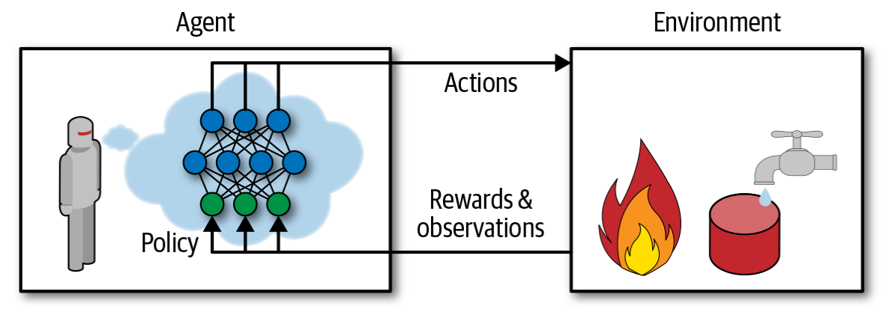

<!-- PROJECT SHIELDS -->
<!-- [![LinkedIn][linkedin-shield]][linkedin-url] -->

# Reinforcement Learning in 3D Simulated Environments

<!-- PROJECT LOGO -->
 
<!-- 

  

  <h3 align="center">Reinforcement Learning in 3D Simulated Environments</h3> -->

<!--   

    Using Unity to simulate environments to train agents using reinforcement learning.
     
    <a href="https://github.com/rasbot/Reinforcement_Learning_in_Unity"><strong>Explore the docs »</strong></a>
     
     
    <a href="https://github.com/rasbot/Reinforcement_Learning_in_Unity">View Demo</a>
    ·
    <a href="https://github.com/rasbot/Reinforcement_Learning_in_Unity/issues">Reinforcement_Learning_in_Unityrt Bug</a>
    ·
    <a href="https://github.com/rasbot/Reinforcement_Learning_in_Unity/issues">Request Feature</a>
  

 -->

<!-- TABLE OF CONTENTS -->
## Table of Contents

* [Introduction](#introduction)
* [Reinforcement Learning Algorithms](#rl-algorithms)
  * [PPO](#ppo)
  * [SAC](#sac)
* [Walking Trainer](#walking)
  * [Untrained Walker](#untrained)
  * [PPO Training](#ppotraining)
  * [SAC Training](#sactraining)
* [Puncher Trainer](#punching)
  * [
* [Contact](#contact)
* [Acknowledgements](#acknowledgements)

<!-- INTRODUCTION -->
## Introduction
---
Reinforcement learning has many useful applications such as robotics and self driving cars. Researchers in artificial intelligence (AI) are constantly improving learning algorithms, and benefit from the ability to train and test their models in different environments. By enabling testing and training within a simulated environment, algorithms can be improved more rapidly. These ideal environments have a physics engine as well as graphics rendering. This is a benefit as well for companies that need to test and deploy trained models in areas like robotics. Having a fully simulated robot within a simulated environment allows for rapid and cost effective testing before testing in a real environment with a real robot.

Machine learning (ML) models depend on what type of learning or predictions are involved.

If the model will make a prediction of a specific target or label from a set of features, supervised learning can be used. If the data is unstructured or unlabeled, and the target feature is not known, unsupervised learning can be used to find relations between features. If the goal is to have a model learn from the environment through interaction, reinforcement learning is used.

Reinforcement learning involves an __agent__, which could be a robot, a self-driving car, or a video game character, that interacts and learns from the __environment__. The agent observes the environment, takes __actions__, and receives __rewards__ based on those actions. The reward could be positive or negative, suchas if a robot moves closer to its target it would get a positive reward, and if it moves away from its target it would get a negative reward. The goal of the model is to maximize the reward to perform a specific task. An agent might not ever receive a positive reward but get penalized suchas an agent navigating a maze. The penalty might be a negative reward for each step and the model trains the agent to minimize the penalty. The algorithm used to train the model is called the __policy__. This will be discussed more later.

The Unity game engine provides an editor which allows for ML algorithms to interact and learn from a variety of simulated environments. Recently the Unity team released version 1.0 of their [ML Agents toolkit](https://github.com/Unity-Technologies/ml-agents). This toolkit, along with the Unity editor, provides a user with the ability to create 3D simulated environments, a Python API to control and integrate ML algorithms into the environments, and a learning pipeline using C# to collect data from the environment, implement agent actions, and collect rewards. Agents can be trained and tested in the Unity engine using the ML agents toolkit.

The Unity Learning Environment

The Python API interfaces with the Unity game engine to create and control ML algorithms in the simulated environment. Python code initializes the environment variables, and feeds agent interactions to the model during training. The trained model is then fed back into the agent during testing.

<!-- ALGORITHMS -->
## Reinforcement Learning Algorithms
---
As mentioned above, the policy is the algorithm used in reinforcement learning (RL). The simplest example, which doesn't involve any learning, is a stochastic policy where an agent randomly moves around an environment. If the goal is to do something like collect all the coins in an environment, a random walk will eventually get the job done. If the policy has feedback from the environment, a more intelligent policy can be adopted.

Reinforcement learning has been used to play simple video games, and improvments to RL algorithms has given researchers and developers a richer ability to train agents to navigate game environments. 

<!-- PPO -->
### Proximal Policy Optimization
Proximal policy optimization (PPO) was released in July 2017 by OpenAI. PPO is a deep learning alogithm that balances easy implementation and tuning while minimizing the cost function and evolving the policy in a "safe" manor, by only making small changes to the previous policy. 

<!-- SAC -->
### SAC

<!-- WALKING TRAINER -->
## Walking Trainer

<!-- UNTRAINED WALKER -->
### Untrained Walker

<!-- PPO WALKER -->
### PPO Training

<!-- SAC WALKER -->
### SAC Training

<!-- CONTACT -->
## Contact

Nathan Rasmussen - nathan.f.rasmussen@gmail.com

Project Link: [https://github.com/rasbot/Reinforcement_Learning_in_Unity](https://github.com/rasbot/Reinforcement_Learning_in_Unity)

<!-- ACKNOWLEDGEMENTS -->
## Acknowledgements

* 
* 
* 

<!-- MARKDOWN LINKS & IMAGES -->
<!-- https://www.markdownguide.org/basic-syntax/#reference-style-links -->

<!-- [linkedin-shield]: https://img.shields.io/badge/-LinkedIn-black.svg?style=flat-square&logo=linkedin&colorB=555
[linkedin-url]: https://linkedin.com/in/nathanfrasmussen -->